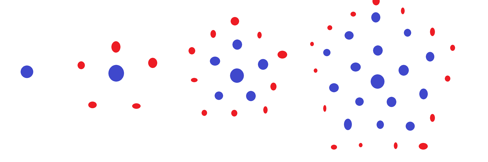

# Pentagonal Number

[Pentagonal Number](https://www.coderbyte.com/language/Pentagonal%20Number)


## 

 Have the function PentagonalNumber(**num**) read **num**    which will be a positive integer and determine how many dots exist in a  pentagonal shape around a center dot on the Nth iteration. For example,  in the image below you can see that on the first iteration there is only  a single dot, on the second iteration there are 6 dots, on the third  there are 16 dots, and on the fourth there are 31 dots.

    

  Your program should return the number of dots that exist in the whole pentagon on the Nth iteration.

  *Hard* challenges are worth *15 points* and you are not timed for them. Use the **Parameter Testing** feature in the box below to test your code with different arguments.


## Parameter Testing

### Test Case #1

```
2
```

### Test Case #2

```
5
```
