# 좌표 이동 - 해설

[좌표 이동](README.md) 문제에 대한 해설

## 문제 해석

2차원 좌표평면에서 x, y 좌표로 이동하면서 아래의 조건을 만족하는 길이와 개수를 출력해야 한다.

1. 이동한 선만 안 겹치면 된다.

2. 방향을 두 번 이상 바꿔야 한다.

3. *k*가 1이면 긴 선이 하나 이상 있어야 한다.

4. 위의 조건을 만족하는 한 굳이 멀리 돌아가지 않아야 한다.

## 입력

*n*과 *m*은 음수일 수도 있으므로 양수로 바꿔준다. (모두 양수로 처리할 것이다.)

따로 처리해야 할 예외가 몇 개 있는데, 그 예외를 쉽게 처리하기 위해 *n*과 *m*을 정렬한다.

(0, 0), (0, 1), (0, 2), (1, 1), (1, 2), (2, 2), (1, *x*), (0, *x*), (0, 3)은 따로 처리해야 할 예외

## 기본

예외는 따로 다루기로 한다. 여기서는 예외를 다루지 않는다.

조건 4번에 의해서 원점과 (*m*, *n*)을 꼭짓점으로 하는 직사각형을 벗어나지 않는다.

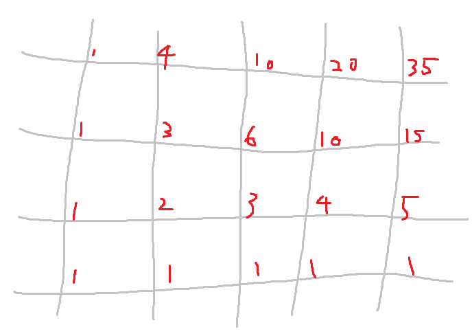

맨 왼쪽 아래 점에서 그 점까지 가는 최단경로의 수를 빨간색으로 표시했다.

모든 행의 왼쪽과 모든 열의 아래쪽은 1이고, 나머지는 왼쪽과 아래를 합한 값이다.

다른 좋은 방법도 있겠지만,  (|*n*|, |*m*| ≤ 1,200) 그냥 O(n * m) 나와도 될 것 같다.

맨 아래에서 두번째 줄은 바로 구할 수 있고, 한 줄이 있으면 그 위의 줄을 구할 수 있다.

맨 아래에서 두번째 줄부터 구하고 맨 위 줄까지 모두 구한 다음에

조건 2에 위배되는 경우(`┌`모양, `┘`모양으로 총 2개)를 빼고

*k*가 1이라면 조건 3에 위배되지 않게 *n* == *m*이면 2를, |*n* - *m*| == 1이면 1을 빼면 된다.

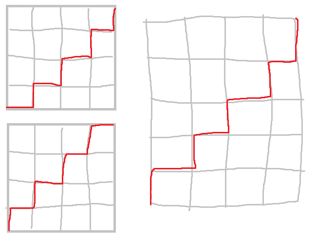

## 예외

위의 방법으로만 하면 조건 3에 위배되는 경우가 생길 수 있다.

아래의 경우에는 따로 처리를 해 줘야 한다.

### *m* = 0, *n* = 0, *k* = 1

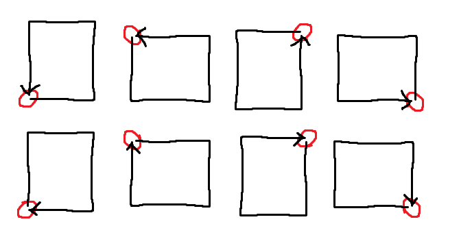

*m*과 *n*, *k*가 모두 0이면 길이는 4, 경우의 수는 8이다.

### *m* = 0, *n* = 0, *k* = 1

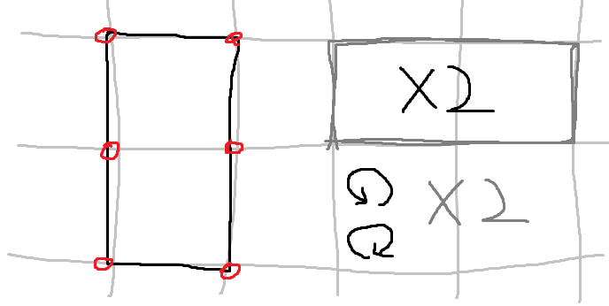

*m*과 *n*이 0이고 *k*는 1이면 길이는 6, 경우의 수는 24이다.

(왼쪽 직사각형 모양(1)에 시작점 위치(x6), 사각형의 모양(x2), 이동할 방향(x2) => 24)

### *m* = 0, *n* = 1, *k* = 0

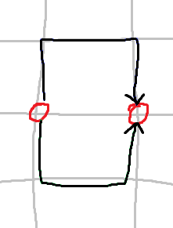

*m* = 0, *n* = 1, *k* = 0이면 길이는 3, 경우의 수는 2이다.

### *m* = 0, *n* = 1, *k* = 1

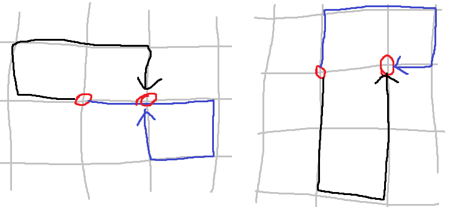

*m* = 0, *n* = 1, *k* = 1이면 길이는 5, 경우의 수는 8이다. (위 네 경우 × 2 (상하반전))

### *m* = 0, *n* = 2

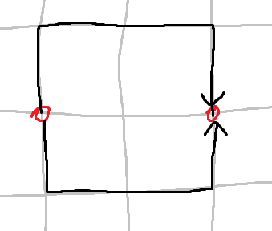

*m* = 0, *n* = 2이면 *k*와는 상관 없이 길이는 4, 경우의 수는 2이다.

### *m* = 1, *n* = 1

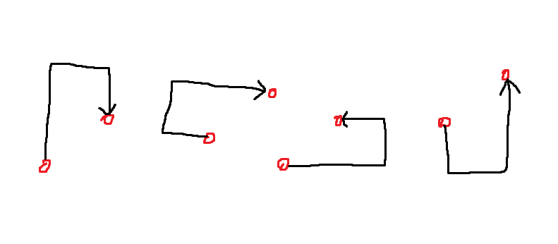

*m*, *n*이 모두 1이면 *k*와는 상관 없이 길이는 4, 경우의 수는 4이다.

### *m* = 1, *n* = 2, *k* = 0

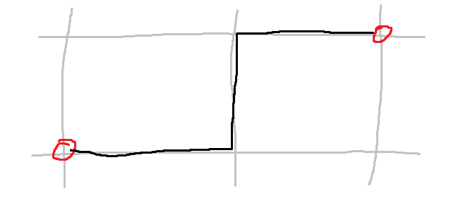

*m* = 1, *n* = 2, *k* = 0이면 길이는 3, 경우의 수는 1이다.

### *m* = 1, *n* = 2, *k* = 1

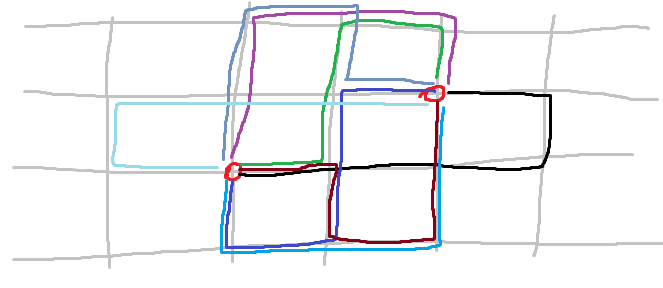

*m* = 1, *n* = 2, *k* = 0이면 길이는 5, 경우의 수는 8이다.

### *m* = 2, *n* = 2

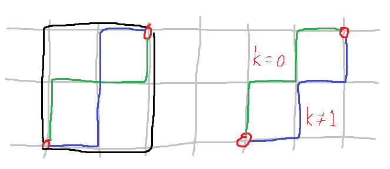

*m*, *n*이 모두 2이면 길이는 4, 경우의 수는 *k*가 0이면 6, *k*가 1이면 4이다.

### *m* = 1, *n* = *x*

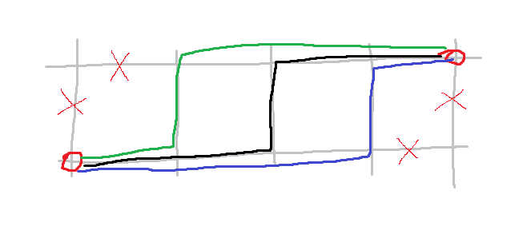

*m*이 1인 경우 길이는 *n* + 1이고 경우의 수는 *n* - 1이다.

### *m* = 0, *n* = *x*

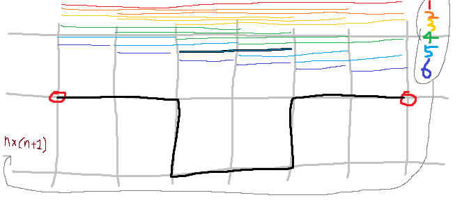

*m*이 0인 경우 길이는 *n* + 2이고 경우의 수는 *n* * (*n* + 1)이다.

(1부터 n까지 더하면 *n* * (*n* + 1) / 2가 되지만, 상하반전(x2)도 있으므로 상쇄)

### *m* = 0, *n* = 3, k = 1

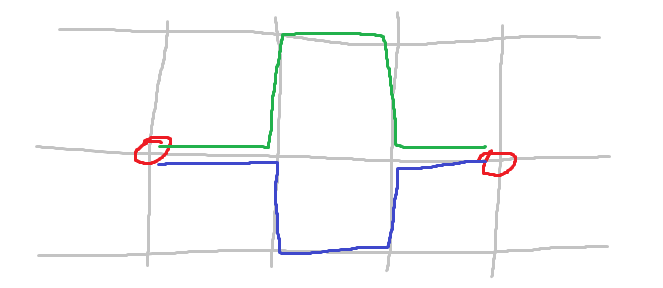

*m* = 0인데 *n* = 3, *k* = 1인 경우에는 **경우의 수에서 2를 빼야** 한다.