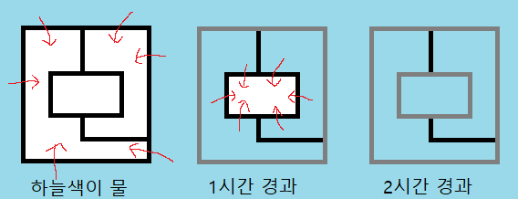

# 홍수 시뮬레이션(Flood) 1

[1025](http://jungol.co.kr/bbs/board.php?bo_table=pbank&wr_id=304)

시간 제한: 1000 ms

메모리 제한: 32 MB


## 문제

지난 1964년에는 기록적인 대홍수가 자그레브 시가지를 강타했었다. 

이때 건물이 많이 파괴되었는데 이는 물의 하중으로 인해 건물을 이루는 벽이 붕괴했기 때문이다. 

이번 문제에서는 그런 도시 형태를 단순하게 모델화한 정보가 입력으로 들어온다. 

여러분은 이를 토대로 어떤 벽이 홍수 후에도 붕괴 없이 존속할 것인지를 찾아야 한다.

 

이 모델은 좌표평면 상에서 N개의 점과 W개의 벽으로 표현된다. 

벽은 그 N개의 점 중 둘을 연결한 선의 형태로 존재하는데 그 선은 중간에 다른 점을 관통하지 않으며 다른 선과 겹치거나 교차하지도 않는다. 

단지 선의 끝점만이 서로 겹칠 수 있다. 또한 선은 좌표평면 상에서 수평선이나 수직선으로만 존재한다.

 

모델의 초기 상태는 비가 오기 전으로 모든 평면이 육지이다. 

그러다 0이라는 시각에 홍수가 시작되어 벽으로 사방이 둘러싸이지 않은 모든 외곽이 물로 뒤덮인다. 

그로부터 정확히 1시간 후에는 물과 육지의 양면 경계를 이루고 있던 벽이 수압을 견디지 못하고 모두 무너진다. 

벽이 무너짐으로써 경계가 없어진 곳에는 이내 물이 더 깊숙이 들어오고 무너진 벽의 내부에 있던 다른 벽이 육지와 물의 경계가 된다. 

이 벽도 역시 1시간이 더 지나면 무너질 것이다. 이 과정이 되풀이됨으로써 결국 무너질 벽은 다 무너지고 모든 영역에 물이 차게 된다.

 

다음은 지금까지 설명한 도시 모델의 한 예를 묘사한 것이다.

 

  

 

N개의 점의 좌표와 이들 점을 연결하는 W개의 벽에 대한 정보를 입력 받아 

이 들 중 홍수 후에도 **무너지지 않고 남아 있는 벽이 몇 개**인지 찾는 프로그램을 작성하시오.


## 입력 형식

첫째 줄에는 정수 N (2≤N≤100,000)의 값이 들어있다. 좌표평면에 있는 점의 개수이다. 
다음 N개의 줄에는 1부터 N째까지 각 점의 X Y 좌표가 하나씩 들어있다. 범위는 0 이상 1,000,000 이하이다. 
점들의 위치는 모두 다르며 두 점이 같은 지점에 겹치는 경우는 없다.
다음 줄에는 벽의 개수 W (1≤W≤2N)의 값이 들어있다. 
그리고 다음 W개의 줄에는 서로 다른 정수 A B (1≤A≤N, 1≤B≤N)가 있으며 
이는 초기 상태에 이 모델에 A째 점과 B째 점을 연결하는 벽이 존재함을 나타낸다. 
벽 역시 1부터 W까지 읽는 순서대로 서열을 매기면 된다.


## 출력

첫째 줄에는 홍수 후에도 남아 있는 벽의 개수 K를 출력한다.


## 입력 예 1

```
15
1 1
8 1
4 2
7 2
2 3
4 3
6 3
2 5
4 5
6 5
4 6
7 6
1 8
4 8
8 8
17
1 2
2 15
15 14
14 13
13 1
14 11
11 12
12 4
4 3
3 6
6 5
5 8
8 9
9 11
9 10 
10 7
7 6
```


## 출력 예 1

```
4
```


## 입력 예 2

```
7
1 3
3 3
3 1
7 1
7 3
7 5
3 5
8
1 2
2 3
3 4
4 5
5 6
6 7
7 2
2 5
```


## 출력 예 2

```
2
```

