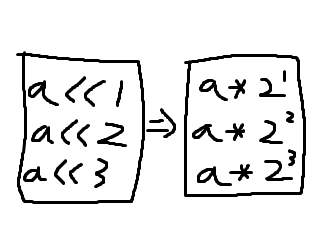

# 한 번에 2n 배로 출력하기(설명)

[47](http://www.koistudy.net/?mid=prob_page&NO=47)

**Time Limit**(Test case) : 1000(ms)


## Background

정수 두 개(a, b)를 입력받아 a를 2^b배 곱한 값으로 출력해보자.

0 <= a <= 10, 0 <= b <= 10

참고

예를 들어 1 3 이 입력되면 1을 2^3(8)배 하여 출력한다.

예시

int a=1, b=10;

printf("%d", a << b); //2^10 = 1024 가 출력된다.



(C언어 기초 100제 v1.1)


## Input

정수 두 개가 공백을 두고 입력된다.
0 <= a, b <= 10


## Output

a 를 2^b배 만큼 곱한 값을 출력한다.


## IO Example

### 입력

```
5 3
```

### 출력

```
*****
*****
*****
```
