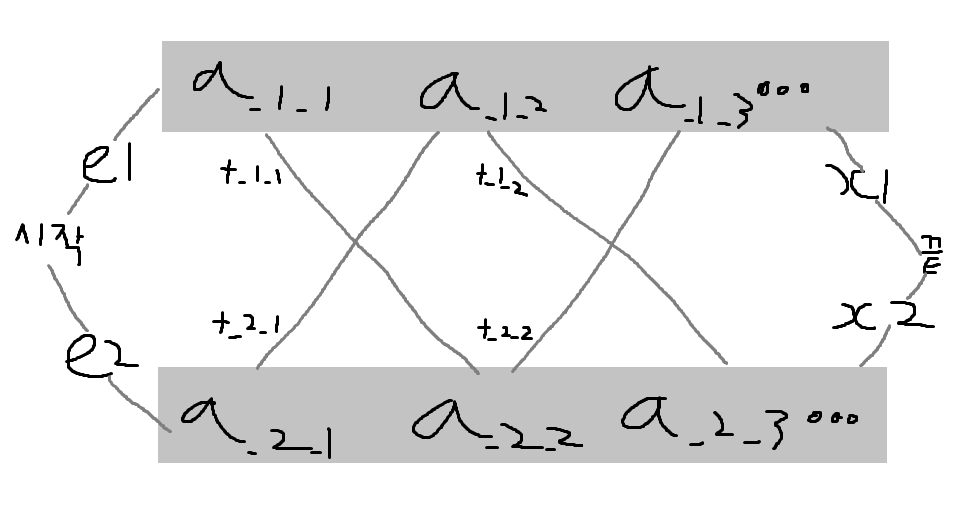

# Assembly Line Scheduling

[ASSEMBLY_LINE_SCHEDULING](https://koitp.org/problem/ASSEMBLY_LINE_SCHEDULING/read/)

시간 제한: 2.0초

메모리 제한: 512 MB


## 문제

명우네 공장에는 두 개의 생산라인이 있고, 각 라인에는 n개의 공정이 순서대로 있다. 하나의 제품이 완성이 되려면 두 생산라인 중 한 생산라인을 정해, 그 생산라인에 미완성 제품이 들어가고 그 생산라인의 n개의 공정을 순서대로 지나, 생산라인에서 생산을 마무리하여 완성된다. 중간에 생산라인을 바꿀 수도 있다.

첫 번째 생산라인의 i번째 공정에서 소요되는 시간은 S_1_i이고, 두 번째 생산라인의 i번째 공정에서 소요되는 시간은 S_2_i이다. 그리고 첫 번째 생산라인에 진입하는 시간은 e1, 두 번째 생산라인에 진입하는 시간은 e2이고, 첫 번째 생산라인에서 생산을 마무리 하는 시간은 x1, 두 번째 생산라인에서 생산을 마무리 하는 시간은 x2이다. 마지막으로 첫 번째 생산라인의 i번째 공정을 마치고 두 번째 생산라인으로 바꾸는데 걸리는 시간은 t_1_i이고, 두 번째 생산라인의 i번째 공정을 마치고 첫 번째 생산라인으로 바꾸는데 걸리는 시간은 t_2_i이다. 즉, 명우의 공장은 아래와 같은 그림으로 표현된다.




## 입력

첫 줄에 라인별 공정의 개수 n, 라인별 진입 시간과 마무리 시간 e1, e2, x1, x2가 주어진다. (2≤n≤300,000, 1≤e1,e2,x1,x2≤200)

두 번째 줄에 S1,1,S1,2,…,S1,n를 나타내는 n개의 자연수가 공백으로 구분되어 주어진다. (1≤S1,i≤200)

세 번째 줄에 S2,1,S2,2,…,S2,n를 나타내는 n개의 자연수가 공백으로 구분되어 주어진다. (1≤S2,i≤200)

네 번째 줄에 t1,1,t1,2,…,t1,n−1를 나타내는 n−1개의 자연수가 공백으로 구분되어 주어진다. (1≤t1,i≤200)

다섯 번째 줄에 t2,1,t2,2,…,t2,n−1를 나타내는 n−1개의 자연수가 공백으로 구분되어 주어진다.  (1≤t2,i≤200)


## 출력

첫 줄에 하나의 제품을 만드는데 걸리는 최소 시간을 출력한다.


## 힌트

### 입력 예제

```
6 2 4 3 2
7 9 3 4 8 4
8 5 6 4 5 7
2 1 1 3 4 
2 1 2 2 1
```

### 출력 예제

```
38
```
